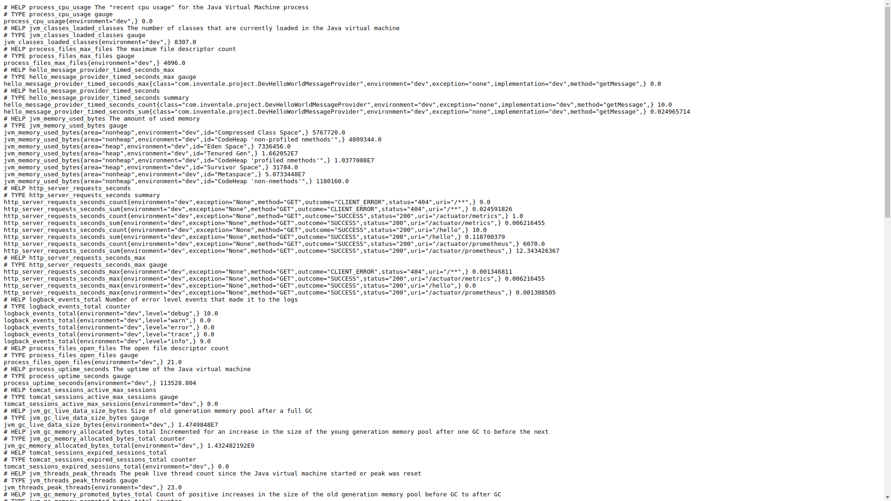

This project is a copy of [spring-boot-template](https://gitlab.inventale.com/platform/templates/spring-boot-template) written using kotlin.

## Key differences from spring-boot-template
1) Kotlin instead of Java ;)
2) No lombock required anymore
3) Plugins `plugin.allopen` and `org.jetbrains.kotlin.plugin.spring` should be enabled for a correct work of Spring
4) It's better to have artifacts `jackson-module-kotlin` and `kotlin-reflect` in the classpath for a correct work of Spring
5) [kotlin-logging](https://github.com/MicroUtils/kotlin-logging) as a wrapper for Slf4j
6) [mockito-kotlin](https://github.com/nhaarman/mockito-kotlin) instead of pure mockito for tests

## Modules

1) buildSrc - Gradle dependencies and plugins configuration
2) model - contains only data classes
3) common - most common classes for all other modules.
4) backend - microservice business logic without Spring dependency 
5) backend-app - endpoints and DI configuration for backend module


## How to start

1) Run `com.inventale.project.HelloWorldApplication`
2) Try it: `curl localhost:8090/hello -v`

## Profiles

We use [Spring profiles](https://docs.spring.io/spring-boot/docs/current/reference/html/spring-boot-features.html#boot-features-profiles)
to deal with environment-specific configurations.
Most common properties are located in the `/config` directory.
Each application can have its own properties in the `resources` path.

### Secret properties

Secret properties can be placed in `local` profile which is active by default
You should copy `config/application-local.yml.template` to `config/application-local.yml`
and specify needed properties.

This file is in gitignore, so the data will be on your local copy only.

### Wrap logs in json format

Sometimes it can be useful to write logs in `json` format, e.g. if you monitor your logs with help of `Kibana`, `CloudWatch`.
`json` format helps to watch logs correctly and use some alerting / monitoring based on logs. 

Logs are recorded if Spring `json-logs` profile is active (by default `json-logs` is included in `production` profile).
`json` logs are built with help of [`LogstashEncoder`](https://github.com/logstash/logstash-logback-encoder)   


## Use cases
* Build project: `./gradlew clean build`

* You can see all outdated dependencies using the command `./gradlew dependencyUpdates`

* You can see information about build and tests `./gradlew clean test --scan`

* Spring boot has built-in tools to get meta information about your application
called [Spring Boot Actuator](https://docs.spring.io/spring-boot/docs/current/reference/html/production-ready-features.html)
You can find it after application starts: `http://localhost:8090/actuator/`

* To change active profiles, you can change the value of the `spring.profiles.active` property in `config/application.yml`
or override this property by environment one. See order and other helpful information in the article https://docs.spring.io/spring-boot/docs/1.2.2.RELEASE/reference/html/boot-features-external-config.html.

* See swagger schema: http://localhost:8090/swagger-ui.html

## Dependency check

We use `owasp` for check dependencies by the plugin `org.owasp.dependencycheck`.
See `id(Plugins.owasp)` in `build.gradle.kts`. Runs by `./gradlew dependencyCheckAnalyze` in `.gitlab-ci.yml`


## Task tree
Optional plugin shows tasks, which will be executed at calling another task. It can help with debugging tasks dependencies while creating your task or optimizing time spent on checks

Example usage: `./gradlew build taskTree --task-depth 3`  
Output will be like:
```
> Task :sdk:taskTree

------------------------------------------------------------
Project :sdk
------------------------------------------------------------

:sdk:build
+--- :sdk:assemble
|    +--- :sdk:assembleDebug
|    |    +--- :sdk:bundleDebugAar ..>
|    +--- :sdk:assembleRelease
|    |    +--- :sdk:bundleReleaseAar ..>
|    +--- :sdk:compileKotlinLinux
|    +--- :sdk:compileKotlinMacos
|    +--- :sdk:compileKotlinMingw
|    +--- :sdk:metadataJar
|    +--- :sdk:mingwMetadataJar
|    \--- :sdk:sourcesJar
\--- :sdk:check
     +--- :sdk:allTests
     |    +--- :sdk:jvmTest ..>
     |    +--- :sdk:linuxTest ..>
     |    +--- :sdk:macosTest ..>
     |    \--- :sdk:mingwTest ..>
     +--- :sdk:ktlintCommonMainSourceSetCheck
     +--- :sdk:ktlintMingwTestSourceSetCheck
     +--- :sdk:lint
     |    +--- :sdk:prepareLintJar
     |    +--- :sdk:processDebugManifest ..>
     |    \--- :sdk:processReleaseManifest ..>
     \--- :sdk:test
          +--- :sdk:testDebugUnitTest ..>
          \--- :sdk:testReleaseUnitTest ..>


(..>) - subtree omitted (exceeds task-depth)
```

More examples you can find at plugin's [homepage](https://github.com/dorongold/gradle-task-tree)

## Prometheus metrics

All exported by application business metrics are declared in `com.inventale.project.metrics.PrometheusMetrics`
HTTP endpoints metrics are exported by default with name `http_server_requests_seconds` 

After the application starts, you can check them here:
* List of all available metrics: `http://localhost:8090/actuator/metrics`
* Metrics page for Prometheus: `http://localhost:8090/actuator/prometheus`


Please note that metrics will appear only after the first call of `/hello` endpoint.

If you want to add `@Timed` annotation please note that it works only for classes but not for interfaces. 

Please pay attention on `com.inventale.project.HelloWorldService.getHelloWorld`.
Here you can find an example of usage of the counter `hello_world_count` and the gauge `hello_world_letters_number`

An example of usage of `@Timed` annotation can be found in `com.inventale.project.DefaultHelloWorldMessageProvider`,
`com.inventale.project.DevHelloWorldMessageProvider` and `com.inventale.project.controller.HelloWorldController`.

This annotation requires the `io.micrometer.core.aop.TimedAspect` bean defined in your Spring configuration.

JVM metrics like memory usage and CPU utilization are exported by default.

### Kotlin Code Style

We use [ktlint](https://github.com/pinterest/ktlint) and [ktlint-gradle](https://github.com/jlleitschuh/ktlint-gradle) 
plugin to check code style.
Rules based on kotlinlang.org and [Android Kotlin Style Guide](https://developer.android.com/kotlin/style-guide) are defined in `.editorconfig`

The `ktlintCheck` task called automatically after default `check`, so your build won't pass if there are code style issues.

It's recommended to update your IDE settings according to rules defined in `.editorconfig`.

Use `./gradlew ktlintApplyToIdea` to change Intellij Idea code style settings.
The task generates IntelliJ IDEA (or Android Studio) Kotlin style files in the project .idea/ folder. Note that this tasks will overwrite the existing style file

Alternatively you can use `./gradlew ktlintApplyToIdeaGlobally`. 
The task generates IntelliJ IDEA (or Android Studio) Kotlin style files in the user home IDEA (or Android Studio) settings folder. 
Note that this task will overwrite the existing style file.

To fix issues automatically please use `./gradlew ktlintFormat`, but some problems like `*` imports can be fixed manually only.
